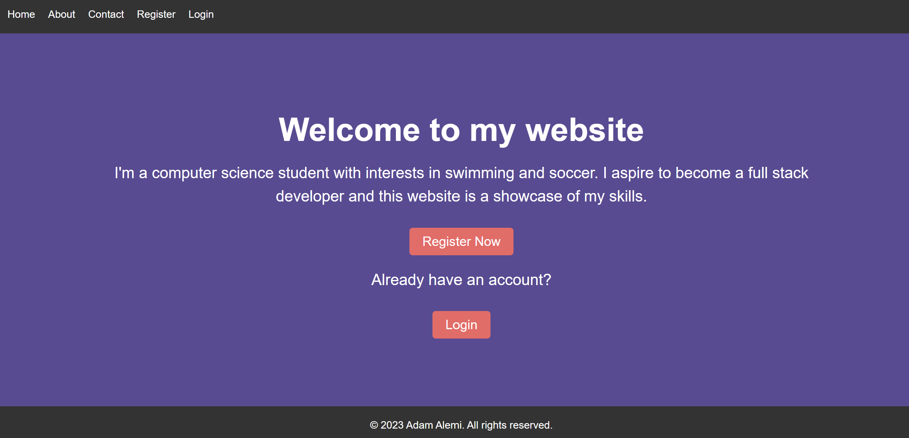
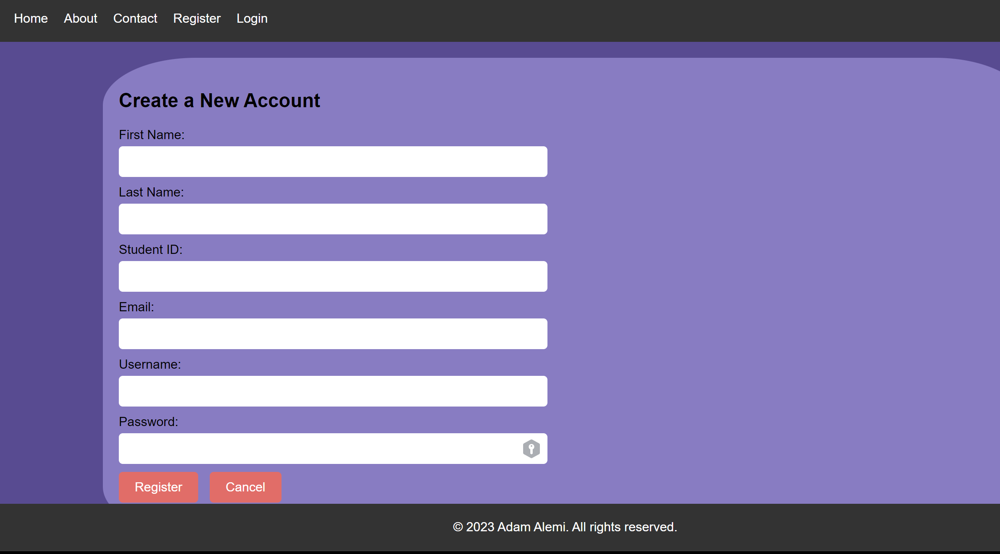
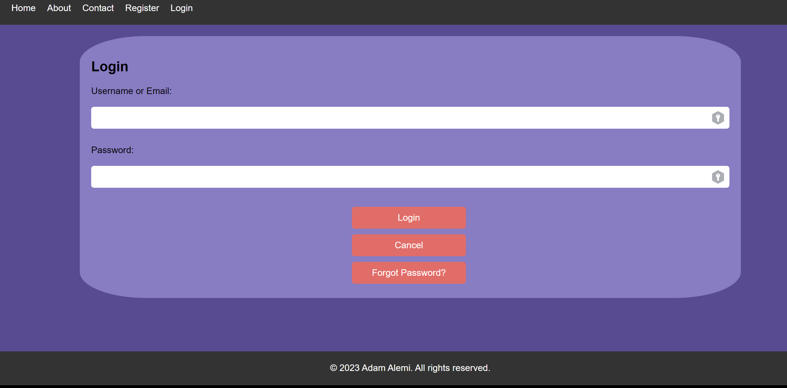
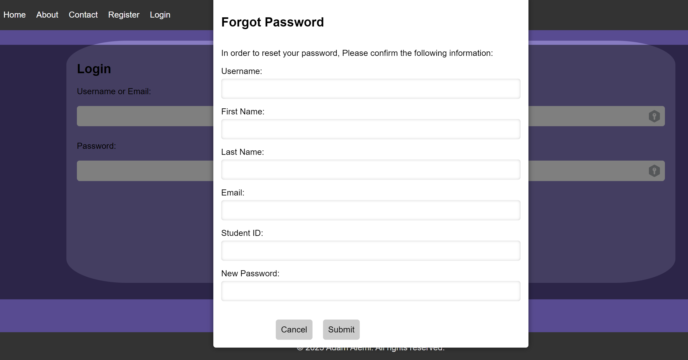
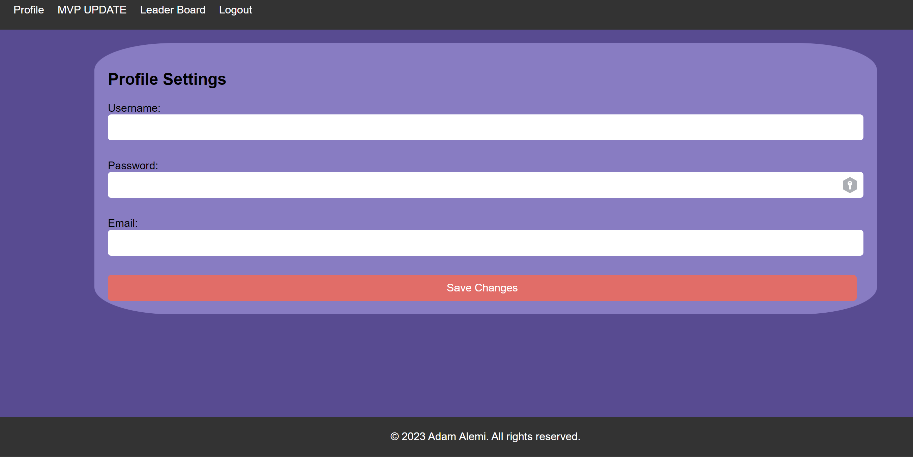
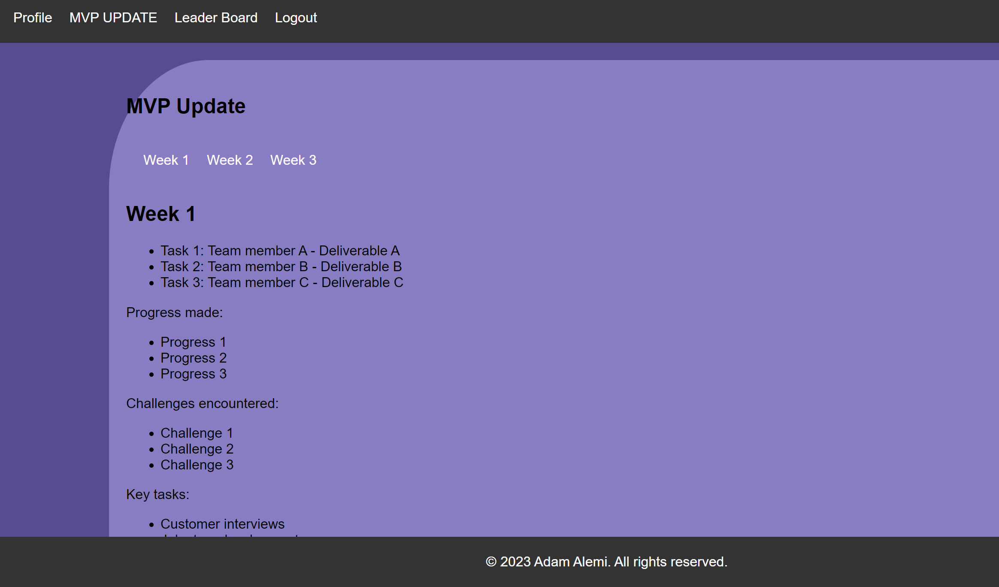

# LeaderBoard Platform

This is a web application for creating and managing leaderboards. It allows you to create and customize leaderboards for any kind of competition, such as sports leagues, gaming tournaments, or academic competitions. 

## Features

- Create and manage leaderboards
- Customizable leaderboard display
- User registration and authentication
- Leaderboard score tracking
- Sorting and filtering of leaderboard data
- about, contact pages 
- profile settings customization
- team projects updates page
- local storage crud
- fully responsive
- server database crud

## Languages used
HTML, CSS, JavaScript, SQL, Python

## Installation

To run the application locally, follow these steps:

1. Clone the repository: `git clone https://github.com/naseralemi12/LeaderBoard-platform.git`
2. Install dependencies: `npm install`
3. Start the development server: `npm start`

## Usage

To use the application, follow these steps:

1. Create a new leaderboard or select an existing one.
2. Add competitors and track their scores.
3. View and customize the leaderboard display.

## Contributing

If you would like to contribute to this project, feel free to submit a pull request or open an issue.

## License

This project is licensed under the MIT License. See the LICENSE file for more details.

## Demo
 <https://youtu.be/6DLnKJscOLg>
 
## Screenshots

